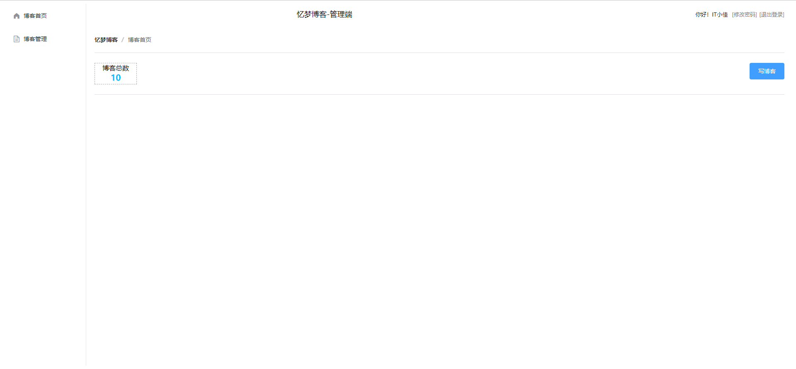

# 忆梦博客-管理端

## 概述

管理端实现了对博客文章的增删改查基础操作，根据浏览器的localStorage进行路由拦截（用户状态的管理），基于axios进行了二次的封装，进而使得API的管理更加集中，提供了统一的请求方法，更加规范的后台数据处理与错误处理。提供专门的模块使得vue的作用域涵盖到自定义的js中，这样就可以在js中使用vue以及一些UI组件，视图与逻辑交互分离，不过这可能会带来一些新的问题，这将会在接下来的开发过程中逐步解决

最新版在旧版的基础上，对旧版功能进行的拓展与完善，使用用户-角色-权限来精细化控制用户的行为与后台功能，新引入了AntDesign UI框架来对之前的ElementUI进行功能与界面上的拓展。

## 技术栈

项目环境：vue 2.6.14

UI框架：ElementUI 2.15.9+AntDesign1.7.8

第三方组件库：

- markdown功能支持：v-md-editor1.7.11
- axios：0.27.2

## 功能概述

### 登录

根据浏览器的localStorage进行路由拦截，并提供了响应机制来管理localStorage进而管理用户的状态

登录使用ElementUI框架中的自动参数校验功能，给用户以友好的错误提示

### 博客首页

首页可以对当前用户博客总数的查看，点击写博客，可以进入博客编辑界面

博客的书写推荐使用markdown语法来写作，目前暂不支持图片、视频等多媒体文件的插入，后续会陆续增加对这些的支持

写完后按键盘上的`Ctrl`+`S`进行或者工具栏上的保存图标按钮进行保存

### 博客管理

提供了对博客的增删改查操作，查询可以根据博客标题进行模糊查询，并对查询结果进行了分页处理

点击编辑按钮可以对某一篇博客进行编辑

点击删除按钮可以删除一篇博客

### 修改密码与退出登录

点击主页上的`修改密码`按钮可以修改当前用户的密码，注意：弹出的密码输入框输入密码是明文，且只要点击`确定`就可以修改成功密码，请谨慎修改，开发环境张如不慎因此忘记密码，请在后台测试代码中调用工具类中的加密方法，得到加密后的密码，并在数据库中手动修改

点击`退出登录`即可退出登录，回到登录界面

## 代码结构

| 文件夹/文件  | 描述                                         |
| ------------ | -------------------------------------------- |
| api          | api接口管理包                                |
| api/business | 所有组件的业务交互代码都定义在这里面         |
| api/api.js   | 数据请求的唯一入口，挂载在原型链上供组件调用 |
| api/http.js  | axios封装，统一请求方法的入口                |
| api/init.js  | 为自定义js获得Vue实例                        |
| common       | 存放一些公共模块，如常量、工具类等           |
| pages        | 管理端界面                                   |
| router       | 全局路由配置                                 |
| App.vue      | 管理端所有页面的入口                         |
| main.js      | 导入组件、挂载原型链                         |

## 配置文件

| 文件名称         | 描述                            |
| ---------------- | ------------------------------- |
| .env.development | 开发环境配置，主要是配置后端URL |
| .env.production  | 生产环境配置，主要是配置后端URL |
| .env.test        | 测试环境配置，主要是配置后端URL |
| package.json     | 不同环境下的node命令就在这里面  |

## node命令

| 命令名称         | 描述                                                 |
| ---------------- | ---------------------------------------------------- |
| admin:dev        | 开发环境启动项目的命令，读取.env.development配置文件 |
| admin:test       | 测试环境启动项目的命令，读取.env.test配置文件        |
| admin:prod       | 生产环境启动项目的命令，读取.env.production配置文件  |
| admin:build:test | 测试环境的打包命令，读取.env.test配置文件            |
| admin:build      | 生产环境的打包命令，读取.env.production配置文件      |

## 开发规范
